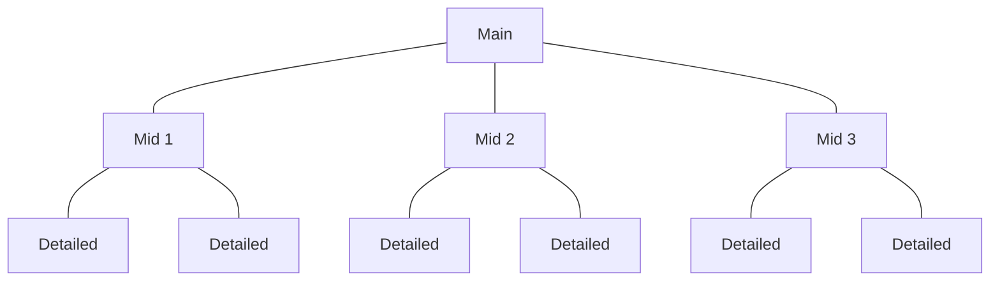
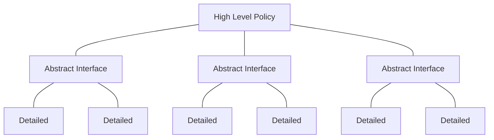
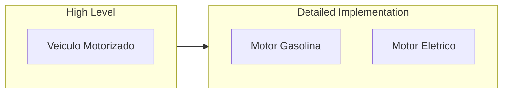
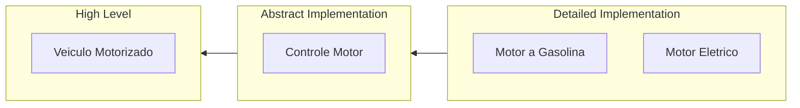

# Dependency Inversion Principle (DIP) 
## Do not Depend Upon Concretions, Depend Upon Abstractions 
###### Depend in the direction of abstraction. High level modules should not depend upon low level details.
---

Procedural Programming



It is hard to imagine an architecture that does not make significant use of this principle. We do not want our high level business rules depending upon low level details. I hope that is perfectly obvious. We do not want the computations that make money for us polluted with SQL, or low level validations, or formatting issues. We want isolation of the high level abstractions from the low level details. That separation is achieved by carefully managing the dependencies within the system so that all source code dependencies, especially those that cross architectural boundaries, point towards high level abstractions, not low level details.
[by Richard C. Martin (2020)](https://blog.cleancoder.com/uncle-bob/2020/10/18/Solid-Relevance.html)

Object Oriented Programming



Something Concrete is volatile, in the other hand something abstract is less volatile


Examples

## Do not depend upon concretions (Não dependa de implementações concretas)


---

#### Exemplo de um simples caso:

High Level

```java
public abstract class  VeiculoMotorizado  extends  Veiculo{  //Alto nivel
private MotorDiesel motorDiesel; //O ato de criar instâncias é favorável a um código mais concreto.
private MotorEletrico motorEletrico; // Um código concreto é mais volátil, um abstrato é menos volátil.
	VeiculoMotorizado(String  marca,  String  modelo,  double  valor,  MotorEletrico  motorEletrico){
		super(marca, modelo, valor);
		this.motorEletrico = motorEletrico;
	}
	VeiculoMotorizado(String  marca,  String  modelo,  double  valor,  MotorDiesel  motorDiesel){
		super(marca, modelo, valor);
		this.motorDiesel = motorDiesel;
	}
	public  String  ligarMotorDiesel(){  return motorDiesel.ligar();  }
	public  String  desligarMotorDiesel(){  return motorDiesel.desligar();  }
	public  String  ligarMotorEletrico(){  return motorEletrico.ligar();  }
	public  String  desligarMotorEletrico(){  return motorEletrico.desligar();  }
}
```
Como teve a necessidade de instânciar os motores, a classe que adotar a postura de **VeiculoMotorizado** tende ter a necessidade indireta de entender o que é trabalhado na classe de baixo nível. É possível visualizar com os diversos métodos para cada instancia diferente criada **ligarMotorDiesel()**, **ligarMotorEletrico()** e etc...  

---

Detailed Implementation
```java
public class MotorDiesel{  //Baixo nivel
private boolean estado;
	public  String  ligar();
		this.estado =  true;
		return  "Ligando Diesel";
	}
	public  String  desligar(){
		this.estado =  false;
		return  "Desligando Diesel";
	}
}

public class MotorEletrico{
 //Pegou a ideia
}
```
---
#### Pior caso:

High Level

```java
public abstract class  VeiculoMotorizado  extends  Veiculo{  //Alto nivel
private MotorDiesel motorDiesel; //O ato de criar instâncias é favorável a um código mais concreto.
private MotorEletrico motorEletrico; // Um código concreto é mais volátil, um abstrato é menos volátil.
	VeiculoMotorizado(String  marca,  String  modelo,  double  valor,  MotorEletrico  motorEletrico){
		super(marca, modelo, valor);
		this.motorEletrico = motorEletrico;
	}
	VeiculoMotorizado(String  marca,  String  modelo,  double  valor,  MotorDiesel  motorDiesel){
		super(marca, modelo, valor);
		this.motorDiesel = motorDiesel;
	}
	public  String  ligarMotorDiesel(){
		motorDiesel.setEstado(true);
		return  "Ligando Diesel";
	}
	public  String  desligarMotorDiesel(){
		motorDiesel.setEstado(false);
		return  "Desligando Diesel";
	}
	public  String  ligarMotorEletrico(){
		motorEletrico.setEstado(true);
		return  "Ligando Eletrico";
	}
	public  String  desligarMotorEletrico(){
		motorEletrico.setEstado(false);
		return  "Desligando Eletrico";
	}
}
```
**VeiculoMotorizado** é responsável pelo controle dos motores **MotorGasolina**,  **MotorEletrico**, **MotorDisesel** etc... 
Tem a necessidade de entender a regra diretamente em que um motor atua como é notável no uso do metodo **setEstado()**.

---

Detailed Implementation

```java
public class MotorDiesel{  //Baixo nivel
private boolean estado;
	public void setEstado(boolean  estado) {
		this.estado = estado;
	}
}

public class MotorEletrico{
 //Pegou a ideia
}
```

---

Aplicação do código:
```java
class  Moto  extends  VeiculoMotorizado{  //Alto nivel
		Moto(String  marca,  String  modelo,  double  valor,  MotorEletrico  motor){
		super(marca, modelo, valor, motor);
	}
		Moto(String  marca,  String  modelo,  double  valor,  MotorDiesel  motor){
		super(marca, modelo, valor, motor);
	}
}

public  static  void  main(String[]  args)  {
	Moto minhaHonda =  new  Moto("Honda","XrNs232312",103223,  new  MotorDiesel());
	System.out.println(minhaHonda.ligarMotorDiesel());
	System.out.println(minhaHonda.desligarMotorDiesel());
	Moto hondaDoVizinho =  new  Moto("Honda","NXLE",123233232,  new  MotorEletrico());
	System.out.println(hondaDoVizinho.ligarMotorEletrico());
	System.out.println(hondaDoVizinho.desligarMotorEletrico());
}
```
É possível notar na aplicação que os detalhes acabam sendo expressados nos níveis superiores da aplicação, podendo até ter relação com a política de negócioo que pode causar acoplamento e depedência.

Saída :
```
Ligando Diesel
Desligando Diesel
Ligando Eletrico
Desligando Eletrico
```


---

## Depend upon abstractions (Dependa de Abstrações)

---
Abstract Implementation
```java
public interface  MotorControle{
	boolean estado;
	public  String  ligar();
	public  String  desligar();
	public  String  verificarEstado();
}
```
---

High Level
```java
public abstract  class VeiculoMotorizado  extends  Veiculo{
protected MotorControle motor;
	VeiculoMotorizado(String  marca,  String  modelo,  double  valor,  MotorControle  motor){
		super(marca, modelo, valor);
		this. Motor = motor;
	}
	public  String  ligar(){return  this.motor.ligar();}
	public  String  desligar(){return  this.motor.desligar();}
	public  String  verificarEstado(){return  this.motor.verificarEstado();}
}
```

**VeiculoMotorizado** não precisa saber de detalhes dos motores, e apenas esperar receber a mensagem que o motor tem a  passar já que sabe o que esperar pelo contrato feito por meio da interface **< MotorControle >**.

---
Detailed Implementation
```java
class  MotorDiesel  implements  MotorControle{
	private boolean estado;
	public  String  ligar(){
		estado =  true;
		return  "Ligando Diesel";
	}
	public  String  desligar(){
		estado =  false;
		return  "Desligando Diesel";
	}
	public  String  verificarEstado()  {
		return estado!=false?("Diesel Ligado"):("Diesel Desligado");
		}
	}
	  
public class  MotorGasolina  implements  MotorControle{
	//Pegou a ideia
}

public class  MotorEletrico  implements  MotorControle{
	//Pegou a ideia
}
```

---

Aplicação do código:
```java
class  Moto  extends  VeiculoMotorizado{
	Moto(String  marca,  String  modelo,  double  valor,  MotorControle  motor){
	super(marca, modelo, valor, motor);
	}
}

public  static  void  main(String[]  args){
	MotorDiesel hondaPX90123 =  new  MotorDiesel();//Entrege por outro módulo da aplicação
	VeiculoMotorizado minhaHonda =  new  Moto("Honda","XrNs232312",103223,hondaPX90123);
	System.out.println(minhaHonda.ligar());
	System.out.println(minhaHonda.desligar());
	
	MotorEletrico hondaLIZRABIAV10 =  new  MotorEletrico();//Entrege por outro módulo da aplicação
	VeiculoMotorizado hondaDoVizinho =  new  Moto("Honda","NXLE",123233232,hondaLIZARBIAV10);
	System.out.println(hondaDoVizinho.ligar());
	System.out.println(hondaDoVizinho.desligar());
	System.out.println(hondaDoVizinho.verificarEstado());
}
```
Neste caso não à um sinal claro de como um motor funciona, se é a gas, diesel ou eletrico, portanto, os níveis superiores não devem se preocupar com os detalhes desse funcionamento.

Saída :
```
Ligando Diesel
Desligando Diesel
Ligando Eletrico
Desligando Eletrico
Eletrico Desligado
```
	
